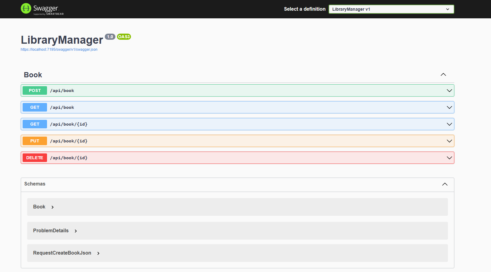

# LibraryManager API

The main objective is to develop an online bookstore API that allows users to create, view, edit and delete books.

<!-- image -->

    

## Features

- [x] Create Book
- [x] View Book
- [x] Edit Book
- [x] Delete Book

## What was used ?

The project was created on react

- [x] C#
- [x] .NET Core
- [x] Visual Studio versão 2022

## Meta

Author - Rockeseat.

programmer - [Fernando Futila] - fernando.futila@gmail.com

---

Done with 💜 by Fernando Futila 👋🏻
